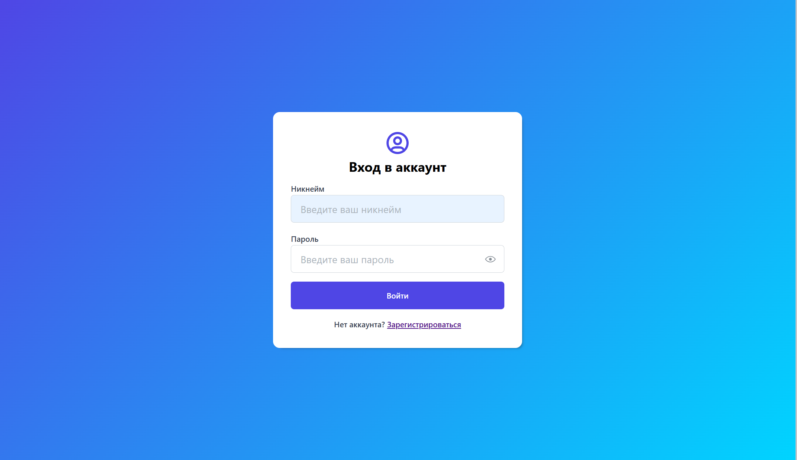
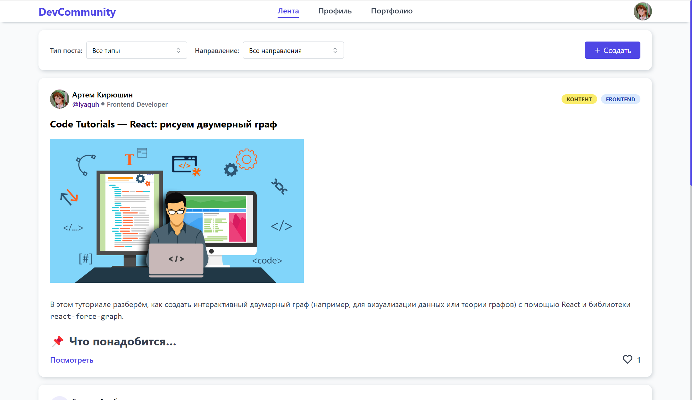
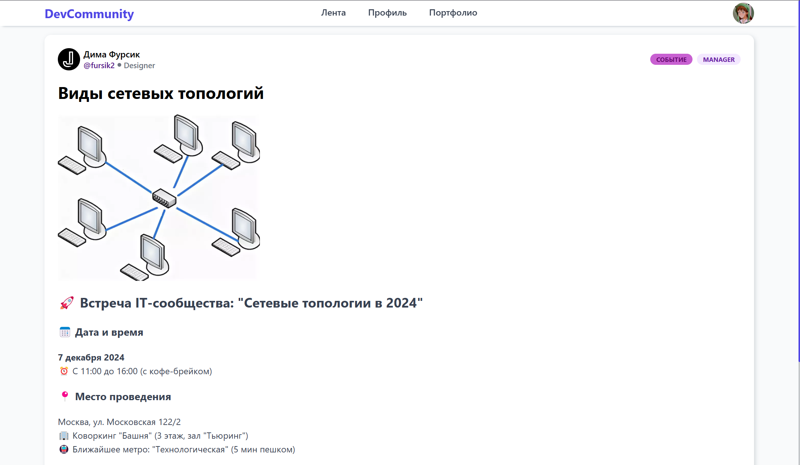
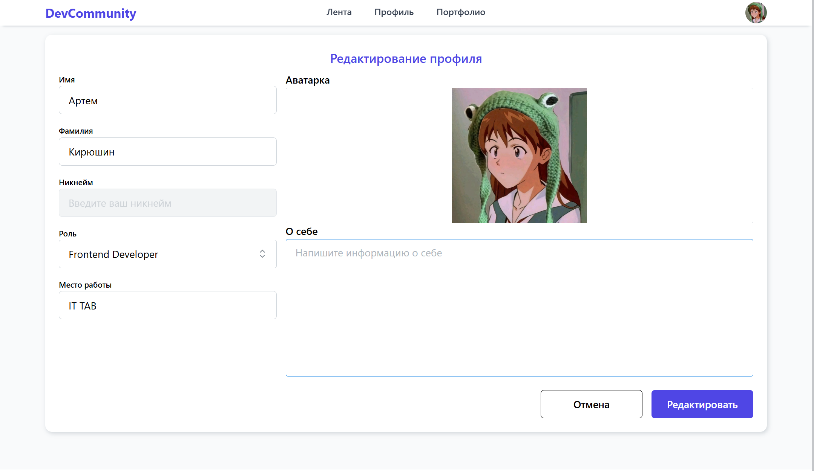
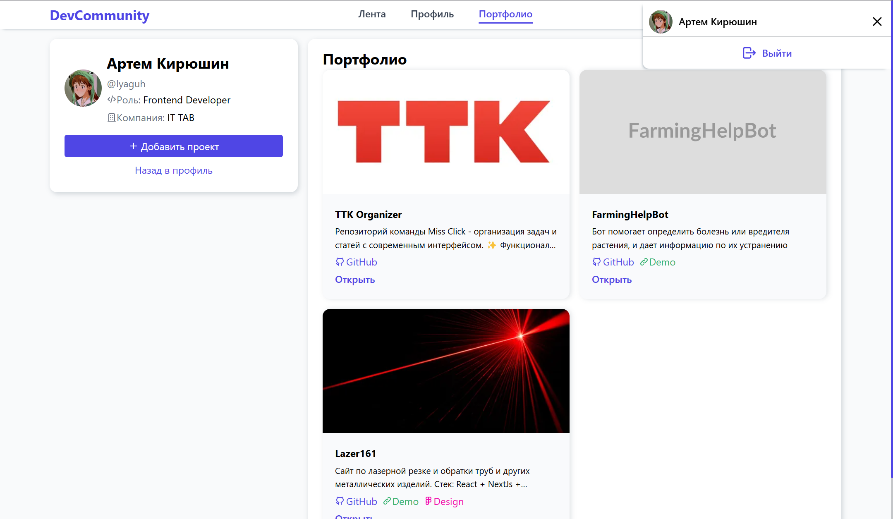
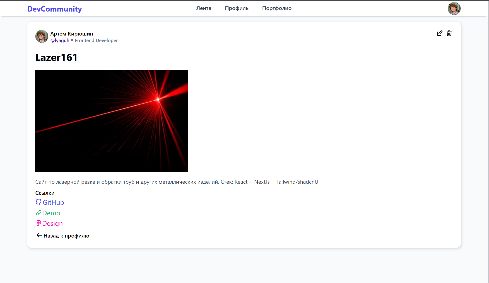
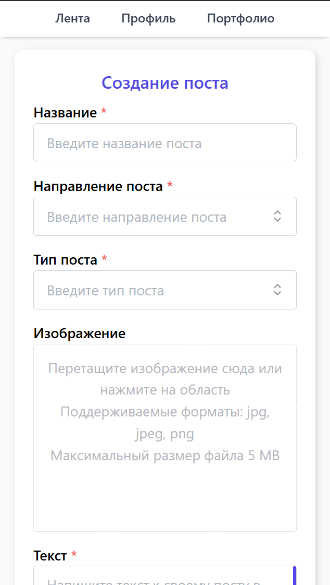

# Форум для IT специалистов - DevCommunity

Проект реализованый в рамках практики в компании ООО"Зазекс"

## ✨ Функционал

- **Аутентификация**

  - Регистрация и авторизация
  - Шифрование паролей и авторизация через JWT HttpOnly cookies

- **Посты**

  - Создание постов трех категорий, возможность добавления фото и текста в формате Markdown
  - Просмотр постов в общей лент
  - Удобная сортировка

- **Профиль**

  - Заполнение профиля информацией о себе
  - возможность посещения профилей других пользователей

- **Проекты**

  - Добавление проектов себе в профиль
  - Возможность просмотра проектов других пользователей

- **Адаптивный дизайн** - для посещения сайта с разных устройств
- **Base64** - хранение фото в формате base64 позволяет не подключать бакет к проекту

## 🛠 Cтек

- **Frontend**

  - React + TypeScript
  - MantineUI
  - Zustand
  - Motion
  - React Router

- **Backend**
  - NestJS
  - MongoDB
  - Docker

И другие мелкие библиотеки

## 📷 Скриншоты

<p align="center">
  
  
  
  
  
  
  
  
  
  
  
  

</p>

## 🚀 Установка и запуск

### Frontend

Устанавливаете [фронтенд репозиторий](https://github.com/Lyaguh21/DevCommunity) в любое удобное место

#

##### Загружаете зависимости

```bash
npm i
```

#

##### Запускаете

```bash
npm run dev
```

### Backend

##### Устанавливаете [бекенд репозиторий](https://github.com/Lyaguh21/DevBackend) в любое удобное место

#

##### Загружаете зависимости

```bash
npm i
```

#

##### Создаете файл .env в корневой папке c содержимым:

```
JWT_SECRET=your-very-strong-secret-min-32-chars
JWT_EXPIRES_IN=3600s
COOKIE_SECURE=true
JWT_COOKIE_EXPIRES_IN=86400
DOMAIN=localhost
NODE_ENV=development
```

#

##### Создание контейнера базы даныых:

```bash
docker compose up -d
```

#

##### Запускаете backend репозиторий

```bash
npm run start:dev
```
