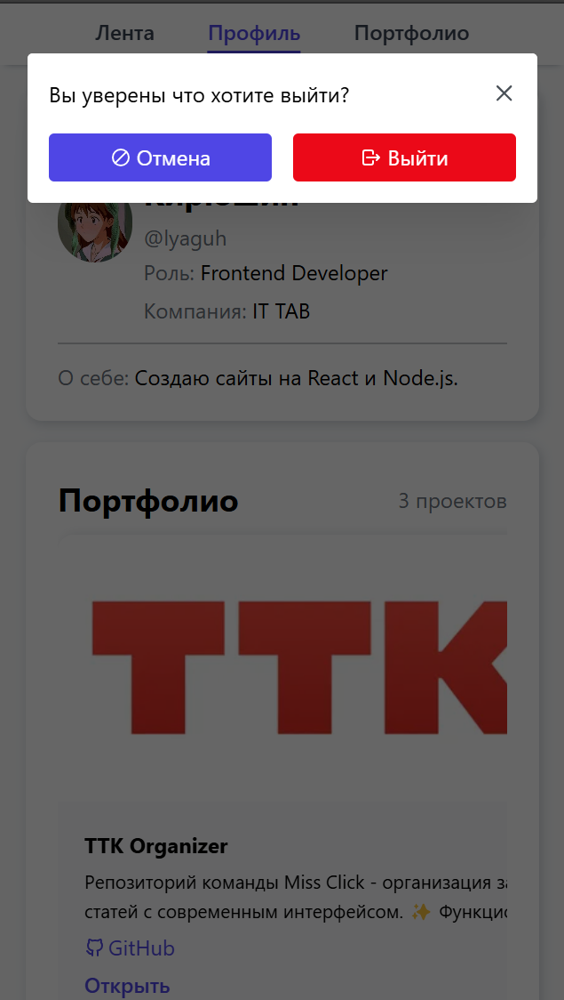

# Форум для IT специалистов - DevCommunity

Проект реализованый в рамках практики в компании ООО"Зазекс"

## ✨ Функционал

- **Аутентификация**

  - Регистрация и авторизация
  - Шифрование паролей и авторизация через JWT HttpOnly cookies

- **Посты**

  - Создание постов трех категорий, возможность добавления фото и текста в формате Markdown
  - Просмотр постов в общей лент
  - Удобная сортировка

- **Профиль**

  - Заполнение профиля информацией о себе
  - возможность посещения профилей других пользователей

- **Проекты**

  - Добавление проектов себе в профиль
  - Возможность просмотра проектов других пользователей

- **Адаптивный дизайн** - для посещения сайта с разных устройств
- **Base64** - хранение фото в формате base64 позволяет не подключать бакет к проекту

## 🛠 Cтек

- **Frontend**

  - React + TypeScript
  - MantineUI
  - Zustand
  - Motion
  - React Router

- **Backend**
  - NestJS
  - MongoDB
  - Docker

И другие мелкие библиотеки

## 📷 Скриншоты

<p align="center">
  
  
  
  
  
  
  
  
  
  
  
  
  
</p>

## 🚀 Установка и запуск

### Frontend

Устанавливаете [фронтенд репозиторий](https://github.com/Lyaguh21/DevCommunity) в любое удобное место

#

##### Загружаете зависимости

```bash
npm i
```

#

##### Запускаете

```bash
npm run dev
```

### Backend

##### Устанавливаете [бекенд репозиторий](https://github.com/Lyaguh21/DevBackend) в любое удобное место

#

##### Загружаете зависимости

```bash
npm i
```

#

##### Создаете файл .env в корневой папке c содержимым:

```
JWT_SECRET=your-very-strong-secret-min-32-chars
JWT_EXPIRES_IN=3600s
COOKIE_SECURE=true
JWT_COOKIE_EXPIRES_IN=86400
DOMAIN=localhost
NODE_ENV=development
```

#

##### Создание контейнера базы даныых (Docker):
Эту команду нужно ввести в консоль(в любом месте)
```bash
docker run --hostname=0cb1699e1f46 --mac-address=6a:4e:74:58:55:cb --env=PATH=/usr/local/sbin:/usr/local/bin:/usr/sbin:/usr/bin:/sbin:/bin --env=GOSU_VERSION=1.17 --env=JSYAML_VERSION=3.13.1 --env=JSYAML_CHECKSUM=662e32319bdd378e91f67578e56a34954b0a2e33aca11d70ab9f4826af24b941 --env=MONGO_PACKAGE=mongodb-org --env=MONGO_REPO=repo.mongodb.org --env=MONGO_MAJOR=8.0 --env=MONGO_VERSION=8.0.10 --env=HOME=/data/db --env=GLIBC_TUNABLES=glibc.pthread.rseq=0 --volume=/data/configdb --volume=/data/db --network=bridge -p 27017:27017 --restart=no --label='org.opencontainers.image.ref.name=ubuntu' --label='org.opencontainers.image.version=24.04' --runtime=runc -d mongo:latest
```
#


##### Запускаете backend репозиторий

```bash
npm run start:dev
```


##### Документация к API(Swagger)

Запускается вместе с сервером(npm run start:dev) на http://[::1]:3000/api-docs
